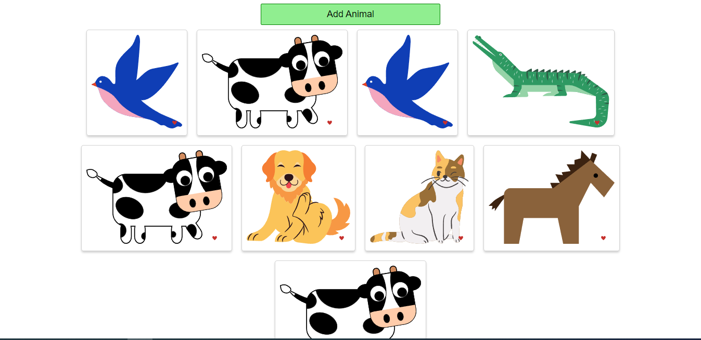

# Animals App



## Overview

The Animals App is a simple React application that allows users to view random animal images by clicking on "Add Animal" button. It's a fun and educational tool for exploring various animal species.

## Features

- Display random animal images on the landing page.
- Click on animal buttons to see images of different animals.
- A collection of 9 different animal images is included.

## Getting Started

To get a copy of this project up and running on your local machine, follow these steps:

1. Clone the repository to your local machine:

   ```shell
   git clone https://github.com/Djomlica/animals-app__react

2. Navigate to the project directory:

3. Install the project dependencies:

npm install

4. Open your web browser and visit http://localhost:3000 to use the application.

## Contributing
Contributions to this project are welcome. If you would like to add features, fix bugs, or improve the documentation, please open a pull request.